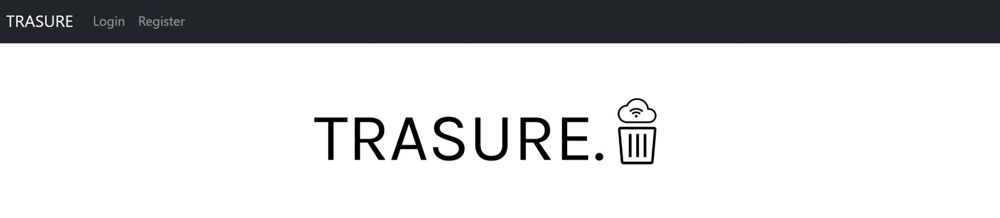
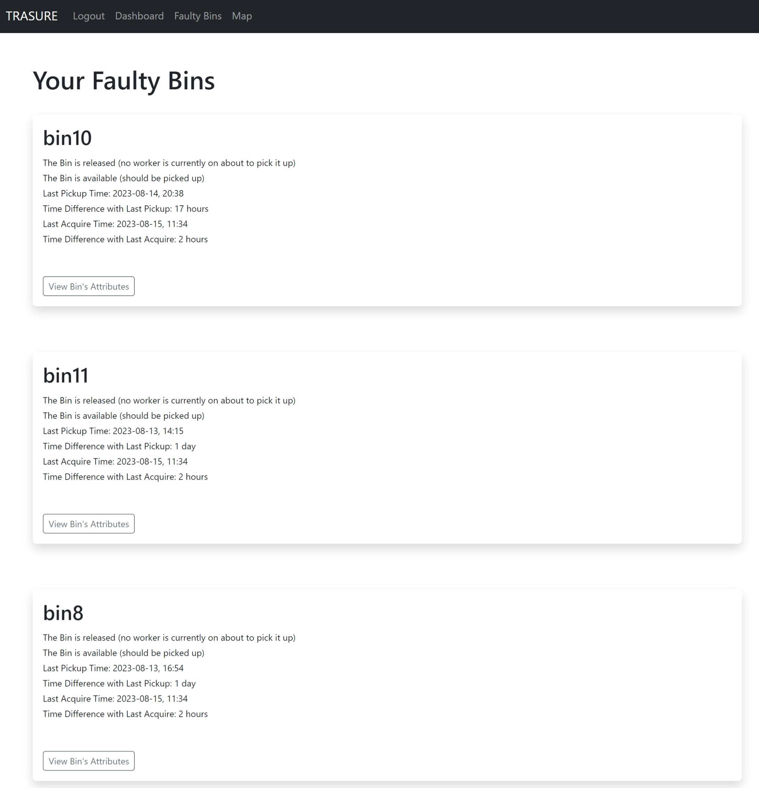
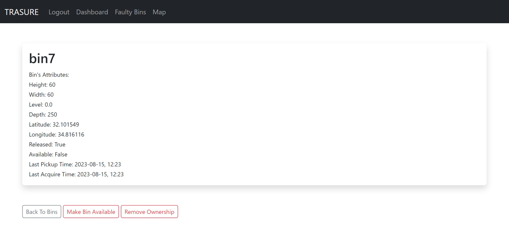
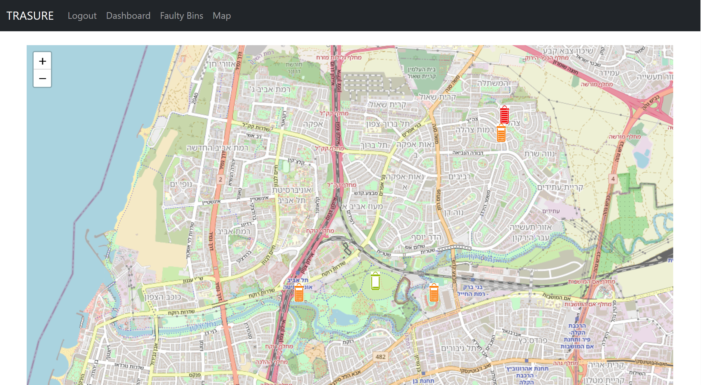

# Trasure Admin Web Application



## Description

The Treasure Web Application provides administrators with a live view of problematic bins on a map. Administrators can update user information, remove ownership of bins, and make bins available for pickup. The scatter map displays all bins, showing their fill levels and IDs.

## Table of Contents

- [Installation](#installation)
- [Usage](#usage)
- [Features](#features)


## Installation

1. Clone this repository to your local machine:
   ```bash
   git clone https://github.com/avivavraham/Trasure_Web_Page.git

2. Open your git Bash and navigate into the project directory.

3. Install the required packages using pip:
    ```bash 
    pip install -r requirements.txt

4. Write the following commands one-by-one:
    ```bash 
    source virt/Scripts/activate
    export FLASK_APP=app.py

## Usage
1. Open your git Bash and navigate into the project directory.

2. Run the following command in the GitBash:
    ```bash 
    flask run

3. Open your web browser and go to http://localhost:5000 to access the web application.

## Features

### Live View of Problematic Bins on Interactive Map



The admin page offers a live view of problematic bins displayed on an interactive map. Each bin is represented by an icon on the map, which can be clicked to access more information about the specific bin. This provides a comprehensive overview of the bins that require attention.

### Manage User Information


Admin users can Register, Login and easily update their personal information, including name, email, age, and username. The user-friendly dashboard allows quick modifications, ensuring that user profiles remain accurate and up-to-date.

### Remove Ownership of Bins + Make Bins Available for Pickup



Admins have the capability to remove ownership of bins that require attention. This action can be performed through a user-friendly interface, streamlining the process of reassigning bins for optimal maintenance.

To prioritize bin collection, admins can make specific bins available for pickup. By doing so, these bins are flagged for immediate attention, ensuring efficient waste collection and management.

### Scatter Map Display



The scatter map offers a comprehensive view of all bins within the system. This feature provides information about each bin's fill level and unique ID. The scatter map aids admins in identifying trends, patterns, and potential issues with bin usage.

These features collectively contribute to effective bin management, offering admins the tools and insights needed to ensure a well-maintained and organized waste collection system.

